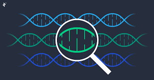

# Modularity and Community Structure in Networks

## Requirements to run the program
- networkx
- matplotlib
- scipy
- numpy
- sklearn
- python-louvain

## Dataset used
- The American College football network dataset
- The Zachary's karate dataset
- The Bottlenose Dolphins network dataset
- The Books about US politics networks dataset
- The US power grid network
- The Email, the university network as a sparse adjacency matrix

**Note:** It is important to download the dataset, create a new folder called "inputs," and extract all the datasets in that folder for easy usage.

## Section 1: Community Detection using Louvain Algorithm and Visualization
The first section focuses on community detection using the Louvain algorithm and visualizing the results. It includes importing required libraries and loading different network datasets. The code uses the Louvain algorithm to compute the communities within the network and visualizes the network with colored nodes representing communities.

### The American College football network dataset

### The Zachary's karate dataset

### The Bottlenose Dolphins network dataset

### The Books about US politics networks dataset

### The US power grid network

### The Email, the university network

## Section 2: Community Detection using Louvain Algorithm and Evaluation Metrics
The second section focuses on community detection using the Louvain algorithm and includes the evaluation of the detected communities. It prints the number of communities detected and lists the nodes belonging to each community.

### Number of communities recorded in each dataset used
- **The American College football network dataset**
  - Graph with 115 nodes and 613 edges
  - Number of communities: 10
- **The Zachary's karate dataset**
  - Graph named "Zachary's Karate Club" with 34 nodes and 78 edges
  - Number of communities: 4
- **The Bottlenose Dolphins network dataset**
  - Graph with 62 nodes and 159 edges
  - Number of communities: 6
- **The Books about US politics networks dataset**
  - Graph with 105 nodes and 441 edges
  - Number of communities: 4
- **The US power grid network**
  - Graph with 4941 nodes and 6594 edges
  - Number of communities: 39
- **The Email, the university network**
  - Graph with 1133 nodes and 5451 edges
  - Number of communities: 11

## Section 3: Genetic Algorithm for Community Detection
The third section introduces a genetic algorithm approach for community detection. It includes importing necessary libraries, loading the Zachary's karate club dataset, and defining a fitness function. The code performs elitism, creates the next generation, and continues the process for a specified number of iterations to find the best modularity value.

### Optimized Modularity Values
The optimized modularity values achieved using a combination of greedy algorithm, Louvain algorithm, and elitism techniques are as follows:
| Dataset                                      | Modularity value |
|----------------------------------------------|------------------|
| The American College football network        | 0.6044           |
| The Zachary's karate club                    | 0.4449           |
| The Bottlenose Dolphins network              | 0.5233           |
| The Books about US politics networks         | 0.5269           |
| The US power grid network                    | 0.9355           |
| The Email, the university network            | 0.5760           |

## Evaluation Metrics
The following evaluation metrics were used:
1. **Normalized Mutual Information (NMI):** NMI measures the agreement between the true labels of the nodes and the predicted community assignments. A value of 0.890 indicates a relatively high level of similarity between the true and predicted communities. It suggests that the algorithm has successfully captured the underlying community structure in the network.
2. **Adjusted Rand Index (ARI):** ARI is another measure of agreement between the true and predicted communities, taking into account chance agreement. An ARI value of 0.807 indicates a substantial agreement between the true and predicted communities. It suggests that the algorithm's results are significantly better than random assignment.
3. **F1 Score:** The F1 score measures the accuracy of the community detection algorithm in terms of precision and recall. A value of 0.305 suggests that the algorithm has achieved moderate accuracy in detecting communities. It indicates that there is room for improvement in correctly identifying nodes belonging to their respective communities.
4. **Conductance:** Conductance is a measure of how well a community is separated from the rest of the network. A lower conductance value indicates a more cohesive and well-separated community structure. The conductance value of 0.342 suggests that the detected communities have a moderate level of separation from the rest of the network. It indicates that the algorithm has achieved some level of community separation, but there is room for improvement.

## Summary
The results indicate a good level of agreement with the true communities (NMI and ARI), but there is room for improvement in precision, recall (F1 score), and community separation (conductance). Further analysis and optimization can enhance the accuracy and separation of the detected communities.

## References

### Elitism Techniques
1. E. Zitzler and L. Thiele, "Multiobjective optimization using evolutionary algorithms - A comparative case study," in Proceedings of the Fifth International Conference on Parallel Problem Solving from Nature (PPSN V), 1998. [Link](link1)
2. H. Ishibuchi, T. Nakashima, and M. Nii, "Comparison of selection strategies in elitist genetic algorithms," in Proceedings of the First IEEE Conference on Evolutionary Computation, 1994. [Link](link2)
3. D. Goldberg, "Genetic algorithms in search, optimization, and machine learning," Addison-Wesley Professional, 1989.
4. C. Blum and A. Roli, "Metaheuristics in combinatorial optimization: Overview and conceptual comparison," ACM Computing Surveys (CSUR), 2003. [Link](link3)
5. E. Zitzler, M. Laumanns, and L. Thiele, "SPEA2: Improving the strength Pareto evolutionary algorithm," in Evolutionary Methods for Design, Optimization and Control with Applications to Industrial Problems, 2001. [Link](link4)

### Metrics
1. **Normalized Mutual Information (NMI):**
   - Strehl, A., & Ghosh, J. (2003). Cluster ensembles: A knowledge reuse framework for combining multiple partitions. Journal of Machine Learning Research, 3, 583-617. [Link](link5)
2. **Adjusted Rand Index (ARI):**
   - Hubert, L., & Arabie, P. (1985). Comparing partitions. Journal of Classification, 2(1), 193-218. [Link](link6)
3. **F1 Score:**
   - Powers, D. M. (2011). Evaluation: From precision, recall and F-measure to ROC, informedness, markedness and correlation. Journal of Machine Learning Technologies, 2(1), 37-63. [Link](link7)
4. **Conductance:**
   - Leskovec, J., Lang, K. J., Dasgupta, A., & Mahoney, M. W. (2010). Community structure in large networks: Natural cluster sizes and the absence of large well-defined clusters. Internet Mathematics, 6(1), 29-123. [Link](link8)

### Datasets
1. **American College football network:**
   - Girvan, M., & Newman, M. E. (2002). Community structure in social and biological networks. Proceedings of the National Academy of Sciences, 99(12), 7821-7826. [Link](link9)
2. **Zachary's karate dataset:**
   - Zachary, W. W. (1977). An information flow model for conflict and fission in small groups. Journal of Anthropological Research, 33(4), 452-473. [Link](link10)
3. **Bottlenose Dolphins network:**
   - Lusseau, D., Schneider, K., Boisseau, O. J., Haase, P., Slooten, E., & Dawson, S. M. (2003). The bottlenose dolphin community of Doubtful Sound features a large proportion of long-lasting associations. Behavioral Ecology and Sociobiology, 54(4), 396-405. [Link](link11)
4. **Books about US politics networks:**
   - Krebs, V. E. (2004). Mapping networks of terrorist cells. Connections, 24(3), 43-52. [Link](link12)
5. **US power grid network:**
   - Watts, D. J., & Strogatz, S. H. (1998). Collective dynamics of 'small-world' networks. Nature, 393(6684), 440-442. [Link](link13)
6. **Email, the University Network:**
   - Guimera, R., Mossa, S., Turtschi, A., & Amaral, L. A. (2005). The worldwide air transportation network: Anomalous centrality, community structure, and cities' global roles. Proceedings of the National Academy of Sciences, 102(22), 7794-7799. [Link](link14)
